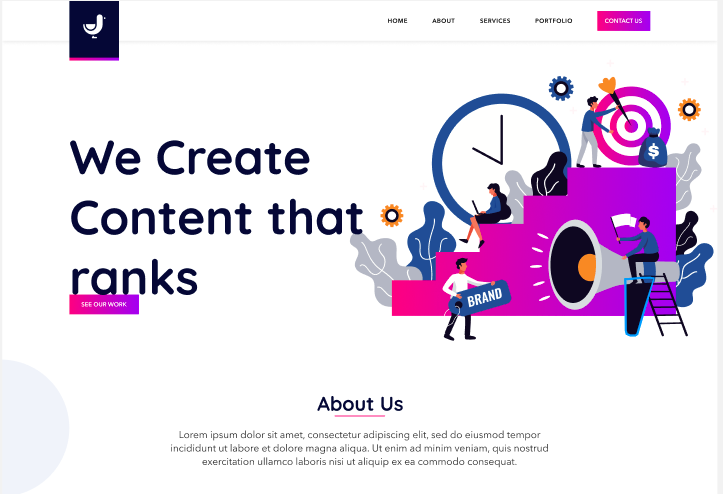

# vela

A responsive WordPress theme.

## To setup the project

* Clone the repo in your project.

`cd htdocs`
`cd advertising/wp-content/themes`
`git clone git@github.com:jyoti-wp/vela.git`
`cd vela`
`cd assets`
`npm install`

* Now Go to WordPress dashboard > Appearance > Themes > Activate Vela theme  

## Create branch

* Replace `your-branch-name` in the below code with your branch name

`git checkout -b feature/your-branch-name`

# Push the code.

`git add .`
`git commit -m "Your commit message`
`git push origin feature/your-branch-name`

## To start the project webpack serve for development.
`cd htdocs`
`cd advertising/wp-content/themes/vela`
`cd assets`
`npm run dev`

